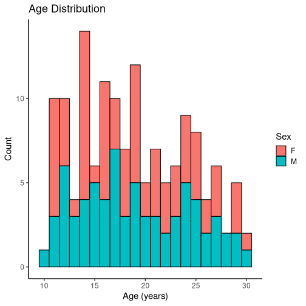
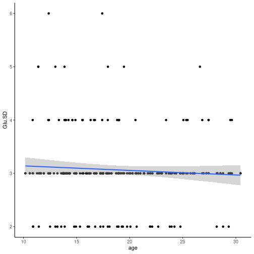

<!-- RENDER:
  rstudio: ctrl+shift+k (or play icon)
  emacs: polymode, poly-r, ess: M-n w (poly-weave)
  R: rmarkdown::render("results.rmd")
-->


# MRSI
9x9x10mm voxel position interactively for all regions of interest. Voxel metabolite concentrations estimated by LCModel.

## Input
 * metabolite concentration per voxel from `data/13MP20200207_LCMv2fixidx.csv`.
 * Spectrum that failed visual inspection annotated in `data/lcm_bad_visual_qc.txt`.


```
##   2130 data/13MP20200207_LCMv2fixidx.csv
##     80 data/lcm_bad_visual_qc.txt
```

### limiting

We exclude spectrum that failed visual inspection, extranous data (non-ROI voxels), poor model fit (high "SD")


|stage         | nsubj| nvisits| nrow|
|:-------------|-----:|-------:|----:|
|all           |   144|     160| 2129|
|visual qc     |   144|     160| 2050|
|visit1 only   |   144|     144| 1756|
|rm SD outlier |   144|     144| 1678|
### Demographics

```r
id_summary <- MRS_cleaned %>% group_by(ld8,age,sex) %>% tally # n=number of ROIs, ignored
ggplot(id_summary, aes(x=age, fill=sex)) +
    geom_histogram(color="black", binwidth = 1) +
    theme_classic(base_size = 15) +
    xlab("Age (years)") + ylab("Count") + labs(fill = "Sex") + 
    ggtitle("Age Distribution")
```




### inverse and quadratic age
Though using linear models, we can model inverse or quadratic chanes in age.
```r
MRS <- add_inv_and_quad_age(MRS_cleaned)
```

## Models
One outlier removal strategy is to remove metabolite concentrations that are 2 standard deviations from the mean.
Another is to remove poor model fit. For most metabolites this is a CRLB ("SD") above `20`. Model input will not include these outlier values. 

```r
z_thres <- 2
```


### Glu

<!-- GLOBALS:
  MRS    -- cleaned data with invage
  zthres -- probably =2
-->


```r
MRS_glu <- MRS %>% filter(Glu.SD <=20)

# ROI 1 (R Anterior Insula) and 2 (L Anterior Insula)

ROI12_Glu <- MRS_glu %>% filter(roi == 1 | roi == 2)
ROI12_Glu <- ROI12_Glu%>%
  mutate(zscore_glu=scale(Glu.Cr), zscore_invage=scale(invage), zscore_gm=scale(GMrat))
ROI12_Glu <- ROI12_Glu %>% 
  filter(abs(zscore_glu) <= z_thres)

#ROI12_Glu %>% select(ld8, label) %>% spread(label, -ld8)

# pick best model
ROI12_Glu_age <- lmer(data=ROI12_Glu, Glu.Cr ~ age + label + sex + GMrat + (1|ld8))
summary(ROI12_Glu_age)
```

```
## Linear mixed model fit by REML ['lmerMod']
## Formula: Glu.Cr ~ age + label + sex + GMrat + (1 | ld8)
##    Data: ROI12_Glu
## 
## REML criterion at convergence: -315.8
## 
## Scaled residuals: 
##      Min       1Q   Median       3Q      Max 
## -2.07219 -0.50477 -0.04637  0.46853  2.29406 
## 
## Random effects:
##  Groups   Name        Variance Std.Dev.
##  ld8      (Intercept) 0.009718 0.09858 
##  Residual             0.008417 0.09174 
## Number of obs: 259, groups:  ld8, 136
## 
## Fixed effects:
##                         Estimate Std. Error t value
## (Intercept)             1.685604   0.053396  31.568
## age                    -0.012116   0.001958  -6.188
## labelR Anterior Insula -0.173308   0.011665 -14.858
## sexM                    0.021698   0.020555   1.056
## GMrat                   0.119360   0.071387   1.672
## 
## Correlation of Fixed Effects:
##             (Intr) age    lblRAI sexM  
## age         -0.767                     
## lblRAntrrIn -0.193  0.013              
## sexM        -0.101 -0.079 -0.017       
## GMrat       -0.671  0.136  0.134 -0.057
```

```r
ROI12_Glu_invage <- lmer(data=ROI12_Glu, Glu.Cr ~ invage + label + sex + GMrat + (1|ld8))
summary(ROI12_Glu_invage) 
```

```
## Linear mixed model fit by REML ['lmerMod']
## Formula: Glu.Cr ~ invage + label + sex + GMrat + (1 | ld8)
##    Data: ROI12_Glu
## 
## REML criterion at convergence: -328.8
## 
## Scaled residuals: 
##      Min       1Q   Median       3Q      Max 
## -2.14655 -0.51341 -0.04705  0.48767  2.28247 
## 
## Random effects:
##  Groups   Name        Variance Std.Dev.
##  ld8      (Intercept) 0.009588 0.09792 
##  Residual             0.008403 0.09167 
## Number of obs: 259, groups:  ld8, 136
## 
## Fixed effects:
##                        Estimate Std. Error t value
## (Intercept)             1.22582    0.04719  25.979
## invage                  4.02037    0.63474   6.334
## labelR Anterior Insula -0.17339    0.01165 -14.878
## sexM                    0.02234    0.02046   1.092
## GMrat                   0.11988    0.07117   1.685
## 
## Correlation of Fixed Effects:
##             (Intr) invage lblRAI sexM  
## invage      -0.690                     
## lblRAntrrIn -0.198 -0.013              
## sexM        -0.239  0.083 -0.017       
## GMrat       -0.548 -0.133  0.134 -0.057
```

```r
ROI12_Glu_quadage <- lmer(data=ROI12_Glu, Glu.Cr ~ age + age2 + label + sex + GMrat + (1|ld8))
summary(ROI12_Glu_quadage) 
```

```
## Linear mixed model fit by REML ['lmerMod']
## Formula: Glu.Cr ~ age + age2 + label + sex + GMrat + (1 | ld8)
##    Data: ROI12_Glu
## 
## REML criterion at convergence: -303.2
## 
## Scaled residuals: 
##      Min       1Q   Median       3Q      Max 
## -2.11638 -0.51311 -0.04832  0.47521  2.29577 
## 
## Random effects:
##  Groups   Name        Variance Std.Dev.
##  ld8      (Intercept) 0.009710 0.09854 
##  Residual             0.008399 0.09165 
## Number of obs: 259, groups:  ld8, 136
## 
## Fixed effects:
##                          Estimate Std. Error t value
## (Intercept)             1.6894982  0.0534583  31.604
## age                    -0.0129470  0.0020779  -6.231
## age2                    0.0004419  0.0003716   1.189
## labelR Anterior Insula -0.1733638  0.0116525 -14.878
## sexM                    0.0222585  0.0205480   1.083
## GMrat                   0.1179681  0.0713364   1.654
## 
## Correlation of Fixed Effects:
##             (Intr) age    age2   lblRAI sexM  
## age         -0.742                            
## age2         0.061 -0.336                     
## lblRAntrrIn -0.193  0.013 -0.004              
## sexM        -0.099 -0.082  0.023 -0.017       
## GMrat       -0.671  0.134 -0.017  0.134 -0.057
```

```r
AIC(ROI12_Glu_age)
```

```
## [1] -301.7586
```

```r
AIC(ROI12_Glu_invage) # best fit by a lot
```

```
## [1] -314.8046
```

```r
AIC(ROI12_Glu_quadage)
```

```
## [1] -287.2147
```

#### effect sizes

```r
ROI12_zGlu <- lmer(data=ROI12_Glu, zscore_glu ~ zscore_invage + label + (1|ld8))
summary(ROI12_zGlu) # just glu ~ age effect
```

```
## Linear mixed model fit by REML ['lmerMod']
## Formula: zscore_glu ~ zscore_invage + label + (1 | ld8)
##    Data: ROI12_Glu
## 
## REML criterion at convergence: 435.2
## 
## Scaled residuals: 
##      Min       1Q   Median       3Q      Max 
## -2.13162 -0.53881 -0.05082  0.53604  2.33317 
## 
## Random effects:
##  Groups   Name        Variance Std.Dev.
##  ld8      (Intercept) 0.1819   0.4265  
##  Residual             0.1658   0.4072  
## Number of obs: 261, groups:  ld8, 137
## 
## Fixed effects:
##                        Estimate Std. Error t value
## (Intercept)             0.33647    0.05151   6.532
## zscore_invage           0.29413    0.04523   6.503
## labelR Anterior Insula -0.77749    0.05108 -15.221
## 
## Correlation of Fixed Effects:
##             (Intr) zscr_n
## zscore_invg  0.020       
## lblRAntrrIn -0.504  0.005
```

```r
ROI12_zGlu_invage <- lmer(data=ROI12_Glu, zscore_glu ~ zscore_invage + label + sex + zscore_gm + (1|ld8))
summary(ROI12_zGlu_invage) # all covariates for table
```

```
## Linear mixed model fit by REML ['lmerMod']
## Formula: zscore_glu ~ zscore_invage + label + sex + zscore_gm + (1 | ld8)
##    Data: ROI12_Glu
## 
## REML criterion at convergence: 435.6
## 
## Scaled residuals: 
##      Min       1Q   Median       3Q      Max 
## -2.14655 -0.51341 -0.04705  0.48767  2.28247 
## 
## Random effects:
##  Groups   Name        Variance Std.Dev.
##  ld8      (Intercept) 0.1850   0.4302  
##  Residual             0.1622   0.4027  
## Number of obs: 259, groups:  ld8, 136
## 
## Fixed effects:
##                        Estimate Std. Error t value
## (Intercept)             0.28324    0.06792   4.170
## zscore_invage           0.29141    0.04601   6.334
## labelR Anterior Insula -0.76170    0.05120 -14.878
## sexM                    0.09813    0.08989   1.092
## zscore_gm               0.06062    0.03599   1.685
## 
## Correlation of Fixed Effects:
##             (Intr) zscr_n lblRAI sexM  
## zscore_invg -0.027                     
## lblRAntrrIn -0.372 -0.013              
## sexM        -0.647  0.083 -0.017       
## zscore_gm   -0.017 -0.133  0.134 -0.057
```

```r
summary(ROI12_zGlu_invage)$coefficients
```

```
##                           Estimate Std. Error    t value
## (Intercept)             0.28323508 0.06791773   4.170267
## zscore_invage           0.29140806 0.04600786   6.333875
## labelR Anterior Insula -0.76170197 0.05119554 -14.878286
## sexM                    0.09812695 0.08988835   1.091654
## zscore_gm               0.06062236 0.03598710   1.684558
```

#### test for interactions w/ age

```r
ROI12_Glu_hemi_int <- lmer(data=ROI12_Glu, Glu.Cr ~ invage * label + sex + GMrat + (1|ld8))
summary(ROI12_Glu_hemi_int) 
```

```
## Linear mixed model fit by REML ['lmerMod']
## Formula: Glu.Cr ~ invage * label + sex + GMrat + (1 | ld8)
##    Data: ROI12_Glu
## 
## REML criterion at convergence: -332.5
## 
## Scaled residuals: 
##      Min       1Q   Median       3Q      Max 
## -2.02412 -0.49799 -0.06983  0.51626  2.39422 
## 
## Random effects:
##  Groups   Name        Variance Std.Dev.
##  ld8      (Intercept) 0.009741 0.09870 
##  Residual             0.008252 0.09084 
## Number of obs: 259, groups:  ld8, 136
## 
## Fixed effects:
##                               Estimate Std. Error t value
## (Intercept)                    1.19488    0.05095  23.452
## invage                         4.62188    0.73888   6.255
## labelR Anterior Insula        -0.10932    0.04180  -2.615
## sexM                           0.02305    0.02052   1.123
## GMrat                          0.11278    0.07104   1.588
## invage:labelR Anterior Insula -1.15021    0.72131  -1.595
## 
## Correlation of Fixed Effects:
##             (Intr) invage lblRAI sexM   GMrat 
## invage      -0.744                            
## lblRAntrrIn -0.412  0.486                     
## sexM        -0.229  0.081  0.013              
## GMrat       -0.480 -0.147 -0.026 -0.058       
## invg:lblRAI  0.376 -0.509 -0.961 -0.019  0.066
```

```r
ROI12_Glu_sex_int <- lmer(data=ROI12_Glu, Glu.Cr ~ invage * sex + label + GMrat + (1|ld8))
summary(ROI12_Glu_sex_int) 
```

```
## Linear mixed model fit by REML ['lmerMod']
## Formula: Glu.Cr ~ invage * sex + label + GMrat + (1 | ld8)
##    Data: ROI12_Glu
## 
## REML criterion at convergence: -332.7
## 
## Scaled residuals: 
##      Min       1Q   Median       3Q      Max 
## -2.11892 -0.51267 -0.03878  0.50203  2.23786 
## 
## Random effects:
##  Groups   Name        Variance Std.Dev.
##  ld8      (Intercept) 0.009553 0.09774 
##  Residual             0.008392 0.09161 
## Number of obs: 259, groups:  ld8, 136
## 
## Fixed effects:
##                        Estimate Std. Error t value
## (Intercept)             1.26806    0.05800  21.864
## invage                  3.27655    0.86977   3.767
## sexM                   -0.06631    0.07388  -0.898
## labelR Anterior Insula -0.17355    0.01165 -14.901
## GMrat                   0.12167    0.07111   1.711
## invage:sexM             1.57154    1.25875   1.248
## 
## Correlation of Fixed Effects:
##             (Intr) invage sexM   lblRAI GMrat 
## invage      -0.808                            
## sexM        -0.614  0.675                     
## lblRAntrrIn -0.167 -0.002  0.006              
## GMrat       -0.433 -0.111 -0.035  0.134       
## invage:sexM  0.583 -0.685 -0.961 -0.011  0.020
```

```r
ROI12_Glu_gmrat_int <- lmer(data=ROI12_Glu, Glu.Cr ~ invage * GMrat + sex + label + (1|ld8))
summary(ROI12_Glu_gmrat_int) 
```

```
## Linear mixed model fit by REML ['lmerMod']
## Formula: Glu.Cr ~ invage * GMrat + sex + label + (1 | ld8)
##    Data: ROI12_Glu
## 
## REML criterion at convergence: -334.4
## 
## Scaled residuals: 
##      Min       1Q   Median       3Q      Max 
## -2.16365 -0.48488 -0.03141  0.44275  2.22545 
## 
## Random effects:
##  Groups   Name        Variance Std.Dev.
##  ld8      (Intercept) 0.009552 0.09774 
##  Residual             0.008439 0.09187 
## Number of obs: 259, groups:  ld8, 136
## 
## Fixed effects:
##                        Estimate Std. Error t value
## (Intercept)             1.13825    0.11978   9.503
## invage                  5.65684    2.15177   2.629
## GMrat                   0.32577    0.26834   1.214
## sexM                    0.02198    0.02045   1.075
## labelR Anterior Insula -0.17413    0.01171 -14.864
## invage:GMrat           -3.77632    4.74308  -0.796
## 
## Correlation of Fixed Effects:
##             (Intr) invage GMrat  sexM   lblRAI
## invage      -0.958                            
## GMrat       -0.944  0.911                     
## sexM        -0.075  0.005 -0.035              
## lblRAntrrIn -0.006 -0.079 -0.040 -0.015       
## invage:GMrt  0.919 -0.956 -0.964  0.021  0.078
```

```r
ggplot(ROI12_Glu, aes(x=age, y=Glu.SD)) + geom_point() + geom_smooth(method="lm") + theme_classic()
```

```
## `geom_smooth()` using formula 'y ~ x'
```



```r
aiglusd_age <- lmer(data=ROI12_Glu, scale(Glu.SD) ~ scale(age) +(1|ld8))
summary(aiglusd_age)
```

```
## Linear mixed model fit by REML ['lmerMod']
## Formula: scale(Glu.SD) ~ scale(age) + (1 | ld8)
##    Data: ROI12_Glu
## 
## REML criterion at convergence: 744.7
## 
## Scaled residuals: 
##     Min      1Q  Median      3Q     Max 
## -1.9099 -0.1620 -0.0709  0.0304  4.1912 
## 
## Random effects:
##  Groups   Name        Variance Std.Dev.
##  ld8      (Intercept) 0.1072   0.3273  
##  Residual             0.8935   0.9452  
## Number of obs: 261, groups:  ld8, 137
## 
## Fixed effects:
##              Estimate Std. Error t value
## (Intercept)  0.003622   0.064976   0.056
## scale(age)  -0.067379   0.065050  -1.036
## 
## Correlation of Fixed Effects:
##            (Intr)
## scale(age) 0.003
```

